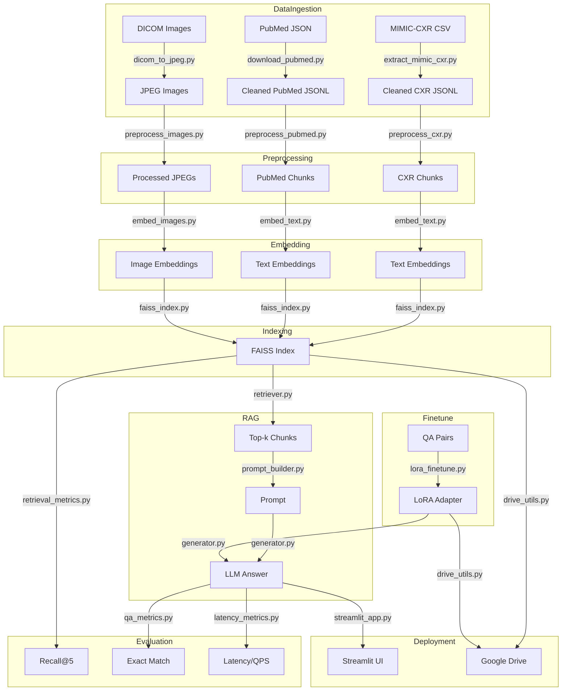
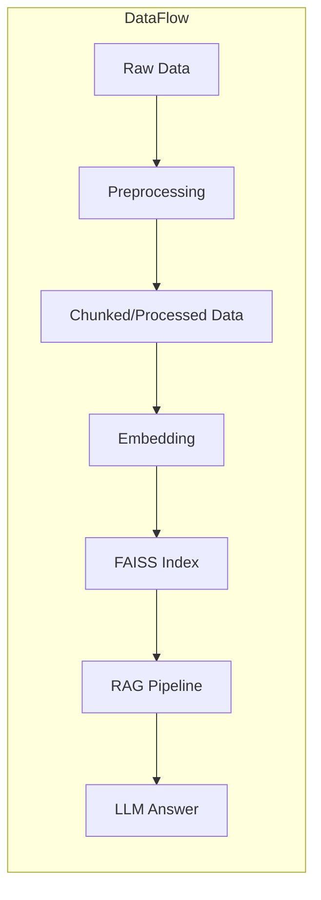
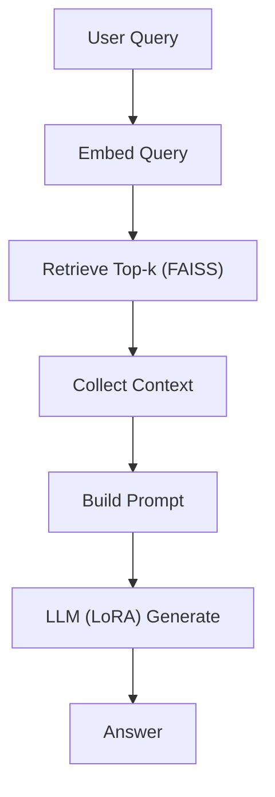

# Efficient Multimodal Healthcare LLM Agent

[](LICENSE)
[](https://www.python.org/downloads/release/python-3100/)

---

## 📑 Table of Contents
- [Project Overview](#project-overview)
- [Key Features](#key-features)
- [Architecture](#architecture)
- [Data Flow](#data-flow)
- [RAG Pipeline](#rag-pipeline)
- [Illustrative Images](#illustrative-images)
- [Module Breakdown](#module-breakdown)
- [Setup & Installation](#setup--installation)
- [Training & Fine-tuning](#training--fine-tuning)
- [Inference & Deployment](#inference--deployment)
- [Contributing](#contributing)
- [Citation](#citation)
- [License](#license)
- [References](#references)

---

## 🚀 Project Overview

**Efficient Multimodal Healthcare LLM Agent** is a research-grade, production-ready clinical assistant that answers healthcare questions using both radiology text (MIMIC-CXR reports, PubMed abstracts) and X-ray images. It leverages a Retrieval-Augmented Generation (RAG) pipeline, LoRA fine-tuning, and state-of-the-art inference optimizations (FlashAttention, paged attention, DeepSpeed, PyTorch Lightning, vLLM) for scalable, high-throughput, and accurate clinical QA.

---

## ✨ Key Features
- **Multimodal RAG**: Combines text and image retrieval for context-rich answers
- **LoRA Fine-tuning**: Efficiently adapts LLaMA-2 7B to clinical QA
- **FlashAttention & Paged Attention**: Ultra-fast inference with vLLM
- **Distributed Training**: DeepSpeed & PyTorch Lightning support
- **Colab/Cloud Ready**: Optimized for T4/A100 GPUs
- **Streamlit UI**: Interactive demo interface
- **Extensible & Modular**: Clean, research-friendly codebase

---

## 🏛️ Architecture



---

## 🔄 Data Flow



---

## 🧩 RAG Pipeline



---

## 🖼️ Illustrative Images

For a visually rich repo, add the following images to the `assets/` directory and reference them in this README:

| Filename                        | Description                                                      |
|----------------------------------|------------------------------------------------------------------|
| `assets/architecture.png`        | Full system architecture (exported from Mermaid or draw.io)      |
| `assets/data_flow.png`           | Data flow from ingestion to answer                               |
| `assets/rag_pipeline.png`        | RAG pipeline step-by-step illustration                           |
| `assets/streamlit_ui.png`        | Screenshot of the Streamlit demo UI                              |
| `assets/example_query.png`       | Example: user query, retrieved context, and generated answer     |
| `assets/colab_runtime.png`       | Colab runtime setup screenshot                                  |

> **Tip:** Use [draw.io](https://draw.io), [Excalidraw](https://excalidraw.com/), or export Mermaid diagrams as PNGs for maximum clarity.

---

## 🗂️ Module Breakdown

- **data_ingestion/**: Scripts for extracting, validating, and converting raw data (MIMIC-CXR, PubMed, DICOM)
- **preprocessing/**: Chunking, tokenization, and image preprocessing utilities
- **embedding/**: Text/image embedding and FAISS indexing
- **rag/**: Retrieval, prompt building, and LLM answer generation
- **finetune/**: LoRA fine-tuning (DeepSpeed, PyTorch Lightning), QA prep, configs
- **inference/**: vLLM runner for FlashAttention & paged attention inference
- **deployment/**: Colab setup, Streamlit UI, Google Drive integration
- **assets/**: Diagrams, screenshots, and illustrative images

---

## ⚙️ Setup & Installation

```bash
# Clone the repo
https://github.com/Deep-De-coder/efficient-multimodal-healthcare-llm-agent.git
cd efficient-multimodal-healthcare-llm-agent

# Install dependencies
pip install -r requirements.txt
```

---

## 🏋️ Training & Fine-tuning

### LoRA Fine-tuning (Standard, DeepSpeed, or Lightning)

**Standard:**
```bash
python finetune/lora_finetune.py \
  --data data/qa_pairs.jsonl \
  --model <llama-2-model-path-or-hf-name> \
  --adapter_output health_lora.pt \
  --epochs 3 \
  --batch_size 8
```

**DeepSpeed:**
```bash
python finetune/lora_finetune.py \
  --data data/qa_pairs.jsonl \
  --model <llama-2-model-path-or-hf-name> \
  --adapter_output health_lora.pt \
  --epochs 3 \
  --batch_size 8 \
  --deepspeed_config finetune/deepspeed_config.json
```

**PyTorch Lightning:**
```bash
python finetune/lora_finetune.py \
  --data data/qa_pairs.jsonl \
  --model <llama-2-model-path-or-hf-name> \
  --adapter_output health_lora.pt \
  --epochs 3 \
  --batch_size 8 \
  --use_lightning
```

---

## ⚡ Inference & Deployment

### Fast Inference with vLLM (FlashAttention & Paged Attention)
```bash
python inference/vllm_runner.py \
  --model <llama-2-model-path-or-hf-name> \
  --adapter health_lora.pt \
  --prompt_file prompts.txt \
  --output_file outputs.txt \
  --batch_size 8
```

### Streamlit Demo
```bash
streamlit run deployment/streamlit_app.py
```

### Colab/Cloud Setup
- See `deployment/colab_setup.ipynb` for a ready-to-run notebook

---

## 🤝 Contributing

Contributions are welcome! Please open issues or pull requests for improvements, bug fixes, or new features.

---

## 📖 Citation

If you use this project in your research, please cite as:

```bibtex
@software{deep_decoder_multimodal_llm_2024,
  author = {Deep-De-coder},
  title = {Efficient Multimodal Healthcare LLM Agent},
  year = {2024},
  url = {https://github.com/Deep-De-coder/efficient-multimodal-healthcare-llm-agent}
}
```

---

## 📝 License

This project is licensed under the [MIT License](LICENSE).

---

## 🔗 References
- [MIMIC-CXR Dataset](https://physionet.org/content/mimic-cxr/2.0.0/)
- [PubMed](https://pubmed.ncbi.nlm.nih.gov/)
- [LLaMA-2](https://ai.meta.com/resources/models-and-libraries/llama-downloads/)
- [LoRA: Low-Rank Adaptation](https://arxiv.org/abs/2106.09685)
- [vLLM](https://github.com/vllm-project/vllm)
- [DeepSpeed](https://www.deepspeed.ai/)
- [PyTorch Lightning](https://www.pytorchlightning.ai/)
- [FAISS](https://github.com/facebookresearch/faiss)
- [Streamlit](https://streamlit.io/)

---

> **Author:** Deep-De-coder 